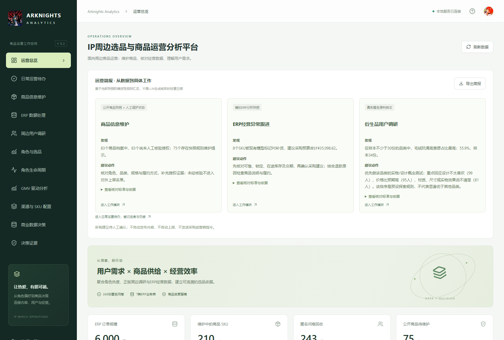
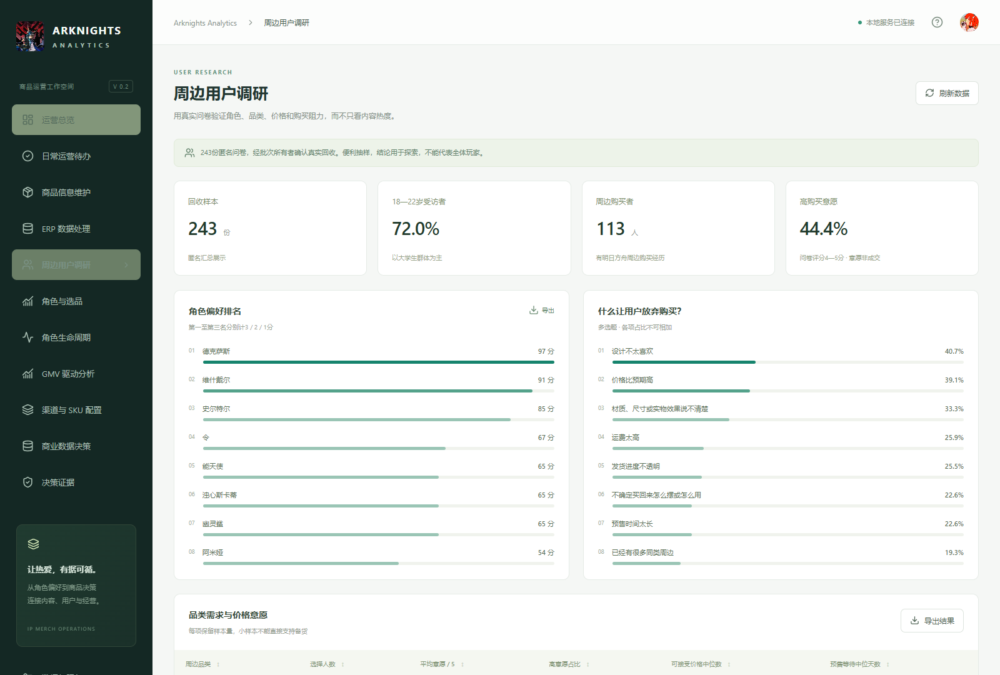
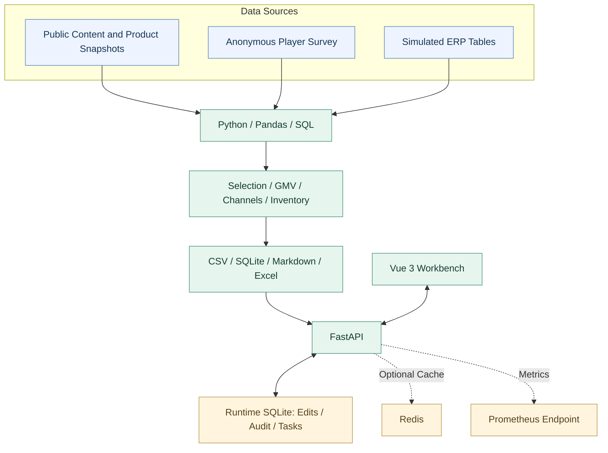

# Arknights Analytics · IP Merchandise Operations Workbench

> A local-first analytics workbench connecting player research, product data, simulated ERP reconciliation and merchandising decisions.
>
> 《明日方舟》IP周边选品与商品运营分析平台：从玩家偏好与公开内容出发，完成商品信息维护、模拟 ERP 核对、营销测算和运营任务跟进。

[](https://github.com/ConstantineChenn/ArknightsAnalytics/actions/workflows/ci.yml)
[](LICENSE)

[Quick Start](#quick-start) · [Workspace Preview](#workspace) · [Data & Methodology](docs/data_sources.md) · [Documentation](docs/README.md) · [Validation](docs/validation.md)

## Why Arknights Analytics

IP周边选品需要同时回答三个问题：**玩家想要什么、商品信息是否可靠、经营方案是否值得验证。** 这些信息通常分散在玩家社区、商品页面、问卷和订单表中，难以直接比较，也不容易转成可执行的运营任务。

Arknights Analytics 将调研、商品档案、交易核对和经营分析放进同一个工作台，保留来源、计算口径和处理记录，让每项建议都能回到具体数据与待办。

| Capability | 解决的问题 | 具体交付 |
| --- | --- | --- |
| **Player Research · 玩家调研** | 内容关注是否对应品类需求和购买意愿？ | 角色偏好、价格接受度、渠道偏好与购买阻力分析 |
| **Selection Validation · 选品验证** | 候选排序是否过度依赖某个来源或主观权重？ | 权重扰动、去源对比、排名稳定性与待验证事项 |
| **Product Data · 商品信息维护** | 商品链接、规格、SKU及授权信息能否准确区分？ | 字段规范、批量预检、人工复核、版本记录与筛选导出 |
| **ERP Reconciliation · 交易核对** | 订单、明细和售后关联后，金额是否重复或失配？ | 订单粒度预聚合、金额与业务规则核对、异常追溯 |
| **Commercial Analysis · 经营分析** | 促销带来的成交额能否覆盖折扣与履约等成本？ | GMV拆解、渠道比较、营销敏感性分析与库存建议 |
| **Operations Workflow · 运营跟进** | 分析结论如何成为可交接的日常工作？ | 负责人、截止日期、处理历史、验收说明与交接表 |

当前基线包含 **243份匿名问卷、60名候选角色、83个公开商品档案**；经营演练使用 **210个模拟SKU、6,000张模拟订单**。不同来源分层保存，详细口径见[数据来源与指标定义](docs/data_sources.md)。

<a id="workspace"></a>

## Workspace Preview



*本地运行截图。首页将商品复核、模拟ERP异常与调研发现整理为运营简报，并提供对应任务入口。*

<details>
<summary>查看玩家调研页面</summary>



*243份匿名便利样本；角色偏好评分、品类需求及购买阻力分别统计，购买意愿不等同于实际成交。*

</details>

工作台提供 **12个页面**，启动后可通过左侧导航访问：

| 工作环节 | 页面与本地路由 |
| --- | --- |
| 发现问题与分派任务 | 运营总览 `/#overview`、日常运营待办 `/#tasks` |
| 维护商品与核对交易 | 商品信息维护 `/#products`、ERP数据处理 `/#erp` |
| 理解玩家与验证选品 | 周边用户调研 `/#research`、角色与选品 `/#selection`、角色生命周期 `/#lifecycle` |
| 比较经营方案 | GMV驱动分析 `/#gmv`、渠道与SKU配置 `/#channels`、商业数据决策 `/#business` |
| 复核依据与服务状态 | 决策证据 `/#decisions`、数据与服务 `/#settings` |

## Architecture



- **来源可追溯：** 公开观察、真实问卷、模拟经营数据分别保留来源与批次；分析结果附输入依据。
- **维护与快照分离：** 商品修改、审计记录和任务状态写入独立运行数据库，保留原始CSV；版本校验防止旧内容覆盖新修改。
- **分析与执行衔接：** 调研建议和核对异常可进入待办，由使用者记录处理结果与验收说明。
- **试点独立管理：** 商业试点另设候选审批、意向、供应商、订单及履约等数据契约；当前主要后续阶段仍待实际记录，不计为已完成销售。

## Evidence & Data Scope

| 工作 | 可复核的规模或结果 | 解释边界 |
| --- | --- | --- |
| 玩家调研 | **243份**匿名答卷，展开为729条角色排名、1,701条品类价格观察 | 展开记录不等于新增受访者，便利样本不代表全体玩家 |
| 选品验证 | **60名角色 × 209组**权重扰动与去源实验，形成12,540条排名观测 | 用于检验候选排序稳定性，不是销量预测准确率 |
| 商品维护 | **19项**字段规范、**83个**公开档案、**210个模拟SKU** | 商品链接与内部SKU采用不同标识；页面授权自述与人工核验分开 |
| ERP核对 | **6,000张模拟订单、7,652条明细、392条售后记录**，30项核对规则 | 当前公开基线为模拟经营数据，不能作为真实成交成果 |
| 经营测算 | **4类营销方案、12组假设**；7类规划渠道形成1,470组SKU适配记录 | 规划渠道与订单渠道按各自口径比较；方案尚需实际实验验证 |
| 公开数据扩充 | 2026-09-12批次新增海外官方商城观察层，含**228个商品、531个变体** | 独立于既有选品基线，美元价格与人民币价格不直接合并 |

**退款修正案例：** 历史模拟快照存在44笔退款超实付异常。修正优惠分摊逻辑后，以相同输入与随机种子独立重建，异常数降至0；历史CSV保留供复核，因此默认看板仍会显示旧快照中的问题。复现方式见 [ERP核对与修正流程](docs/erp_checks_workflow.md)。

角色生命周期模块区分宣传事件、观察窗口与需求变化；当前证据不足以判定连续趋势的角色保持待验证。缺少访问量、客户级历史等输入时，不推算访问转化率、复购或LTV。详见[数据边界](docs/data_sources.md)与[方法说明](docs/methodology.md)。

<a id="quick-start"></a>

## Quick Start

需要 **Python 3.11+、Node.js 22+、pnpm 11.19.0**。默认使用仓库已有快照；首次启动不需要联网采集、重建数据、Redis或Docker。

### 1. 安装后端依赖

```powershell
git clone https://github.com/ConstantineChenn/ArknightsAnalytics.git
cd ArknightsAnalytics
python -m venv .venv
.\.venv\Scripts\python.exe -m pip install -r requirements.txt
```

### 2. 构建前端

```powershell
# 尚未安装pnpm时执行
npm install --global pnpm@11.19.0

pnpm --dir frontend install --frozen-lockfile
pnpm --dir frontend build
```

### 3. 启动工作台

```powershell
.\.venv\Scripts\python.exe scripts/run_platform.py
```

- 工作台：[http://127.0.0.1:8765/](http://127.0.0.1:8765/)
- API文档：[http://127.0.0.1:8765/docs](http://127.0.0.1:8765/docs)
- 健康检查：[http://127.0.0.1:8765/api/health](http://127.0.0.1:8765/api/health)

macOS / Linux将上述Python路径替换为 `.venv/bin/python`。端口占用时增加 `--port 8766`。开发模式、可选Docker Compose及接口说明见[工作台使用指南](docs/platform_guide.md)；离线重算与新增数据导入见[分析与采集工作流](docs/workflows.md)。

## Tech Stack

| Layer | Stack |
| --- | --- |
| Frontend | Vue 3 · Vite |
| API | Python · FastAPI · Uvicorn |
| Analytics | Pandas · NumPy · SQL · Matplotlib |
| Storage & Exchange | SQLite · CSV · Excel / openpyxl |
| Optional Infrastructure | Redis · Nginx · Prometheus · Docker Compose |
| Validation | pytest · pytest-cov · GitHub Actions |

## Validation Baseline

2026-09-21基于公开代码 `d83465d` 重新验证：

| 检查 | 结果 |
| --- | --- |
| Python自动化测试 | **262 passed** |
| Python语句覆盖率 | **81.86%**，3,637 / 4,443 statements |
| 前端依赖与构建 | `pnpm install --frozen-lockfile`、`pnpm build` 通过 |
| 浏览器冒烟检查 | 运营总览与玩家调研页加载通过，未捕获页面JavaScript异常 |

完整命令、环境、警告与检查范围见[验证记录](docs/validation.md)。该记录不代表已完成生产部署、全页面交互验收或实际营销效果验证。

## Repository Layout

```text
frontend/                    Vue 3工作台
src/arknights_merch_analytics/ 分析模块、FastAPI、商品维护与任务逻辑
scripts/                     启动、采集、导入、分析与复现入口
data/                        来源快照、问卷数据与处理结果
reports/generated/           Markdown报告、SQLite与Excel分析产物
docs/                        使用指南、数据口径、方法与试点流程
tests/                       分析、API与业务规则测试
deploy/                      可选部署配置
```

## Documentation

- [文档导航](docs/README.md)：按使用、分析、核对和试点任务查找材料。
- [工作台使用指南](docs/platform_guide.md)：商品维护、ERP筛选、导出、待办与本地部署。
- [数据来源与指标定义](docs/data_sources.md)：基线与扩充批次、真实与模拟数据、GMV与样本口径。
- [分析与采集工作流](docs/workflows.md)：离线复现、可选采集、问卷导入及报告位置。
- [验证记录](docs/validation.md)：测试结果、覆盖率与本轮检查范围。

## Scope & License

本项目面向本地研究、作品展示与运营流程验证，默认绑定 `127.0.0.1`。当前没有生产级登录、角色权限或多人审批；跨来源写入校验不替代身份认证。私有试点运行数据库不纳入版本管理。

代码采用 [MIT License](LICENSE)。第三方平台内容、商品图片与《明日方舟》相关名称及素材的权利归原权利人所有；本项目为独立个人项目，与游戏官方及所列平台无隶属关系。
